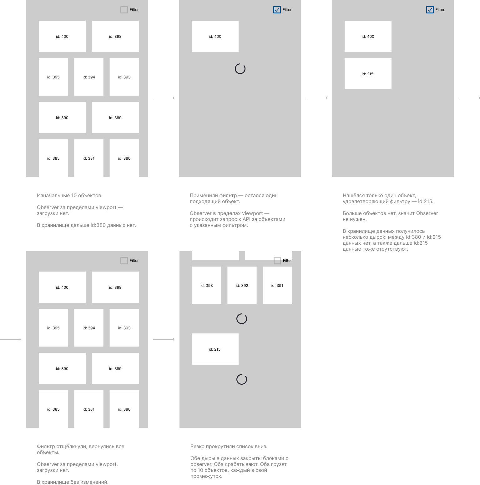

## Тестовое задание (Front-end middle / JS + Vue.js)

В работе находится страница референс-лист объектов компании. Сайт будет работать на собственной CMS. Не PWA. Разработан собственный алгоритм формирования страниц сервером и принципы интерактивности на клиенте. Для хорошей индексации (SEO) сервер будет отдавать уже частично отрендеренный блок объектов (SSR — Server Side Rendering), а также блок `<script>` тут же в коде HTML, внутри которого будет переменная с JSON — это копия данных отрендеренных объектов для дальнейшей обработки во Vue.

Алгоритм типовой для SSR: страница загружается с начальными объектами в блоке `#reference`, запускаются Vue-скрипты, которые берут значение переменной в качестве первоначальных данных и маунтят вывод в тот же самый отрендеренный блок `#reference`. Так как по факту новая DOM-структура блока получается идентичной существующей, Vue будет использовать уже существующие DOM-элементы и перерисовка будет незаметной. Таким же образом на странице работает меню навигации, можно заглянуть туда. Вся дальнейшая работа на клиенте будет уже непосредственно с Vue-скриптом, а обращение за новыми данными к серверу — JSON-запросами к API.

> Для удобства разработки, дальнейшего масштабирования и переиспользования компонентов мы используем методологию БЭМ. Каждый модуль (блок) реализован отдельным Vue-скриптом, использует свой шаблон, строгую систему именования классов БЭМ, свою CSS. Все модули взаимодействуют между собой через глобальные переменные, созданные при инициализации инстанса Vue.

Модуль референс-листа `vue_reference.js` должен непосредственно взаимодействовать с модулем фильтров `vue_filters.js`. Изначально, в коде задания модуль референс-листа не доделан, он только берёт первоначальные данные из JSON и рендерит их в DOM, а также имитирует подгрузку объектов по достижении нижнего края экрана (блок с Intersection Observer в конце списка). Фактически же он должен обращаться к API и догружать объекты из базы, используя параметры `limit`(сколько объектов получить в JSON. В текущей задаче рекомендуется `limit: 10`, именно столько объектов потенциально влезают в один экран) и `offset`(сколько объектов пропустить от конца), а также параметр `tags:[]` который позволяет отфильтровать объекты по тегу на стороне сервера. На данный момент API ещё не готово, поэтому работу API нужно имитировать с выводом деталей запроса к API в консоль.

## Принцип работы

На странице есть 10 последних объектов из базы. Каждый раз по достижении конца списка срабатывает Intersection Observer и догружается по 10 следующих объектов (POST-запрос в формате JSON). Каждый объект имеет собственный массив тегов `[id_tag, id_tag, ...]`. Фильтры на странице работают как фильтрация объектов по одному или по нескольким тегам (принцип AND — отображаемый объект должен иметь все выбранные теги). Модуль фильтра отдаётся в коде страницы в виде пустого контейнера `#filters` + блок `<script>` с переменной filters и JSON внутри + скрипт `vue_filters.js` в конце страницы.

На старте `vue_filters.js` должен сформировать блок фильтров по данным из переменной. В дальнейшем, при выборе пункта фильтра, скрипт `vue_filters.js` взаимодействует с `vue_reference.js` и последний отсортировывает список объектов по выбранному тегу. Если достигнут конец отсортированого списка, `vue_reference.js` должен сделать запрос к API и догрузить новые 10 объектов, используя серверную фильтрацию (сервер в запросе к API принимает параметр `tags: [ id_tag, id_tag, ...]` и выдаёт только объекты с данными тегами). Это важно, т.к. объектов в базе может быть несколько тысяч, а с каким-то редким тегом — единицы. Соответственно, если грузить весь список объектов и только потом фильтровать — скорость и качество работы на клиенте будет далёкими от идеала.

Если пользователь снимает выбор фильтров, `vue_reference.js` должен отобразить обратно все объекты из хранилища. При этом, логично, случится ситуация, что выведенный список будет иметь «дыры» в данных, т.к. в хранилище после фильтрации данные загружались нелинейно. Нужно эту ситуацию предусмотреть и в промежутках вставить блоки с Intersection Observer, при достижении которых должно происходить заполнение «дыр» запросами по 10 объектов.

### Визуализация принципа работы



---

# Задача

1. Сделать модуль фильтров: вёрстку (код блока `#reference` и таблицу стилей `filters.css`), а также код модуля `vue_filters.js`.

2. Доработать модуль референса `vue_reference.js` для взаимодействия с фильтрами и имитацией подгрузки новых объектов.

3. На данный момент Intersection Observer работает неверно — блок статично стоит в конце шаблона и при первой инициализации данных попадает во viewport. Предполагается замена логики работы блока в процессе модификации `vue_reference.js`. Блок должен стать, по сути, отдельным компонентом `referenceLoader`, работающим по принципу трассирующего блока — последним объектом в выдаче. При попадании во viewport блок должен инициировать подгрузку следующих объектов, по 10 штук каждый раз. Если в выдаче есть несколько «дыр», каждая из них должна быть закрыта собственным инстансом трассирующего блока `referenceLoader`. Если сервер возвращает пустой массив — значит объектов данного типа больше нет и инстанс компонента `referenceLoader` уничтожается.

## Комментарии к задаче

- Вёрстка блока фильтров — просто список всех доступных тегов с чекбоксами в блоке `#filters`. Вёрстка не является целью тестового задания, оцениваться будет в первую очередь программный функционал, поэтому время можно сэкономить и сделать по-простому. При желании, чекбокс можно использовать из `assets/images/icon_checkbox.svg`.

- Id объектов — натуральные числа. Первый в базе — объект с id: 1. Но при этом обязательно нужно учитывать, что id в рамках одной выдачи могут с пропусками диапазонов — id: 400, id: 398, id: 397, id: 395... такое случается, обычно, когда объекты удаляют или ограничивают показ.

Формат POST-запроса к серверу:
```json
  {
    "section": "reference",
    "action": "list",
    "limit": "10",
    "offset": "10",
    "tags": ["1", "2"]
  }
```

Ответ сервера:
```json
[
  { "id": "1",
    "title": "Агропромышлен&shy;ный холдинг «Великолукский мясокомбинат»",
    "bghex": "#00254F",
    "img": "./img/bg/ref05.jpg",
    "date_created": "2022-10-13 22:16:15",
    "seen": "2633",
    "url": "velikolukskij_myasokombinat",
    "place": "г. Великие Луки, Новгородская обл.",
    "tags": ["1","2"]
  },
  {
    "id": "5",
    "title": "Название объекта",
    "bghex": "#CCFFCC",
    "img": "./img/bg/ref01.jpg",
    "date_created": "2021-09-12 11:16:15",
    "seen": "32",
    "url": "newton_live",
    "place": "г. Город объекта",
    "tags": ["1", "2", "5"]
  } 
]
```
Если данных нет — пустой массив.
